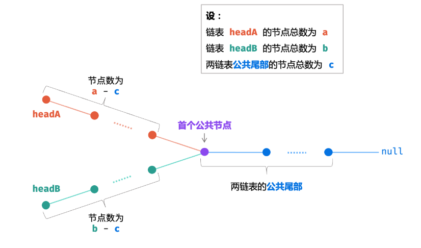

## 相交链表
---

```python
class Solution:
    def getIntersectionNode(self, headA: ListNode, headB: ListNode) -> Optional[ListNode]:
        # 让A,B 同时走完各自的链表然后从对方的头结点继续走 
        A, B = headA, headB
        while A != B:
            A = A.next if A else headB
            B = B.next if B else headA
        return A
```