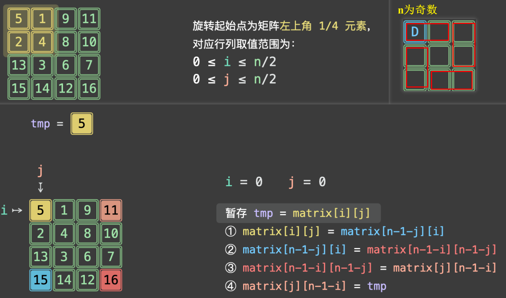

## 旋转图像



```python
class Solution:
    def rotate(self, matrix: List[List[int]]) -> None:
        # 主要就是找到每个ij对应的四个需要旋转的坐标
        n = len(matrix)
        for i in range(n // 2):
            for j in range((n + 1) // 2):
                tmp = matrix[i][j]
                matrix[i][j] = matrix[n - 1 - j][i]
                matrix[n - 1 - j][i] = matrix[n - 1 - i][n - 1 - j]
                matrix[n - 1 - i][n - 1 - j] = matrix[j][n - 1 - i]
                matrix[j][n - 1 - i] = tmp


```